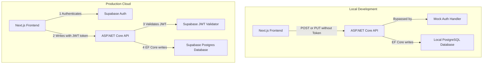
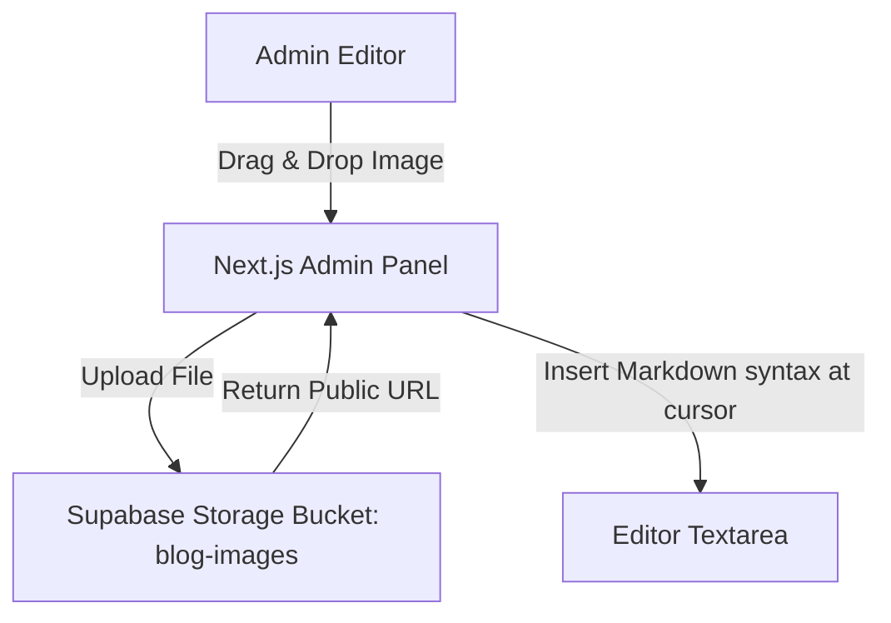
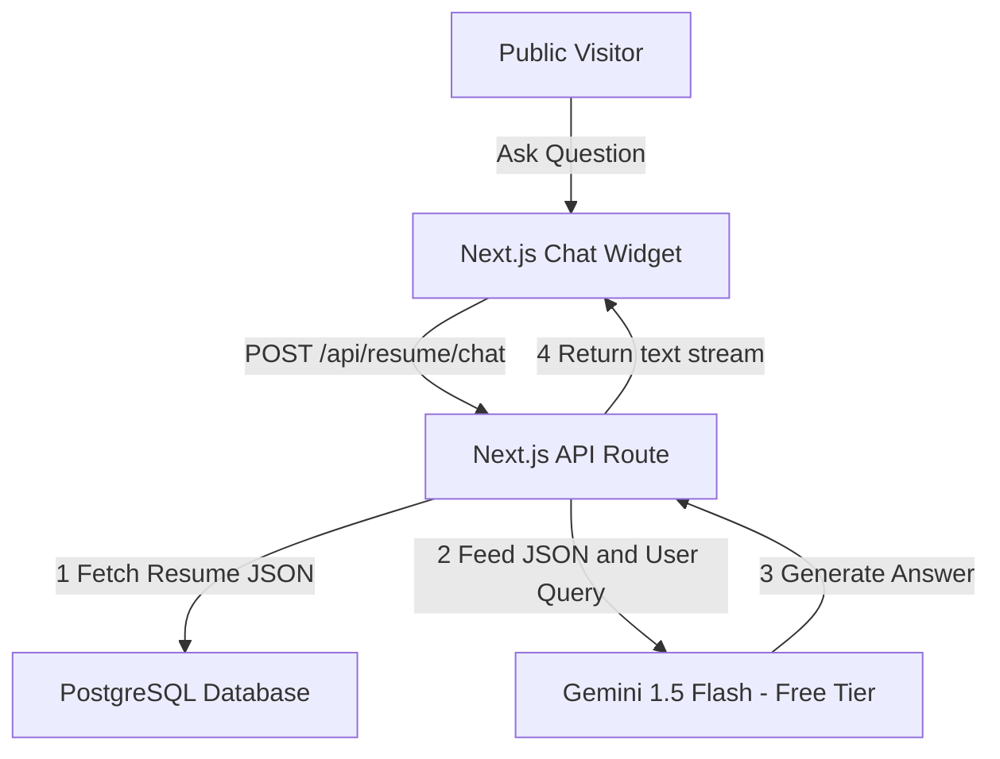
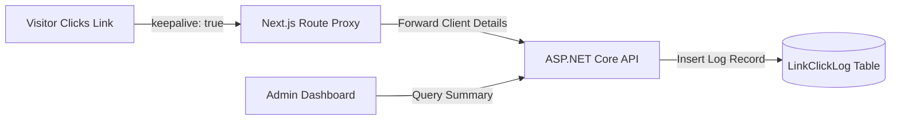
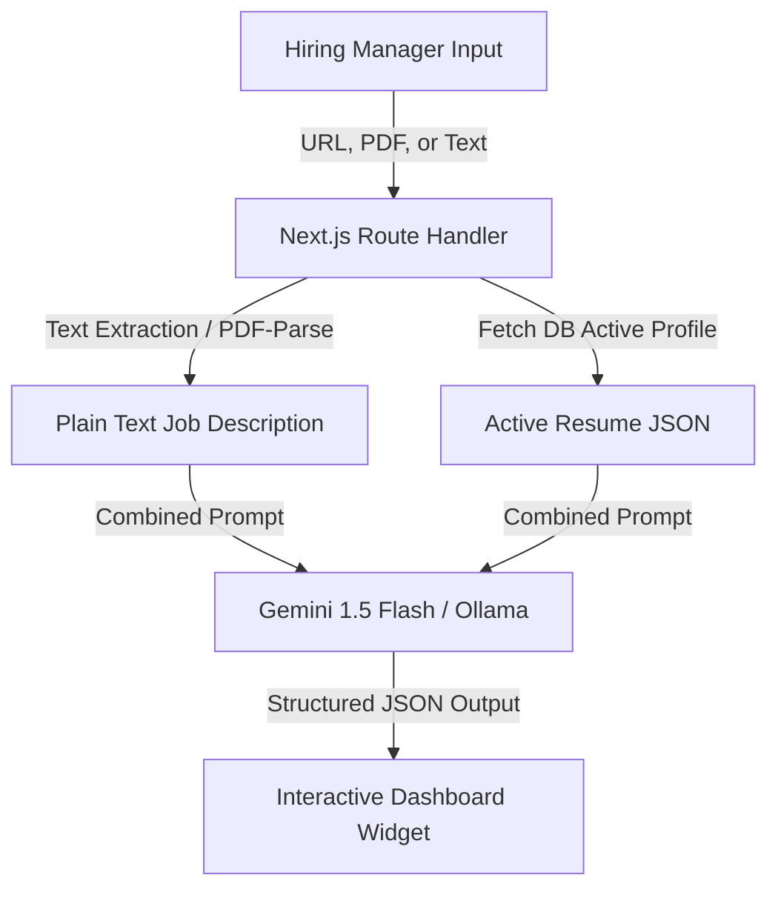
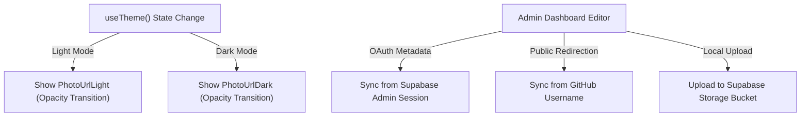

# Architectural Plan: Data-Driven AI-Integrated Portfolio System

## Goal & System Summary
We are building a data-driven, AI-integrated portfolio management system that transitions a static JSON portfolio website into a telemetry-rich, relational-backed web application. Key elements of the system include:
1. **Relational Database**: Storing multiple resume profiles, skills, experiences, and analytics logs in PostgreSQL.
2. **Secure Administration**: An authenticated admin dashboard with OAuth (GitHub, Google, Magic Link) secured by an email claiming whitelist (`ADMIN_EMAIL`), and EF Core audit logs of all changes.
3. **AI Chatbot & RAG Analyzer**: A client-side chatbot and server-side parser scoring candidate profiles against uploaded job descriptions.
4. **Traffic Attribution**: Geolocation-aware logging of page views and outbound link clicks matching session UTM referral parameters.
5. **Quality Gatekeeping**: Fully automated test suites executing on every pull request, integrated with GitHub Actions and Render's deployment status checks (Option A: Auto-deploying after checks pass).

This document outlines the detailed system configurations, schemas, API specifications, and testing topologies.

---

## 1. System Architecture




---

## 2. Database Schema (PostgreSQL)

The database schema is identical for both local and cloud databases. You can apply this schema locally via EF Core migrations, and it will be pushed to Supabase when you run your migrations in production.

```sql
-- 1. Resume Profile / Header Info (Normalized)
CREATE TABLE "ResumeProfile" (
    "Id" UUID PRIMARY KEY DEFAULT gen_random_uuid(),
    "Name" VARCHAR(100) NOT NULL,
    "Title" VARCHAR(100) NOT NULL,
    "Intro" TEXT NOT NULL,
    "PhotoUrlLight" VARCHAR(500) DEFAULT 'https://images.unsplash.com/photo-1534528741775-53994a69daeb?auto=format&fit=crop&w=300&q=80', -- Stock Light Photo
    "PhotoUrlDark" VARCHAR(500) DEFAULT 'https://images.unsplash.com/photo-1507003211169-0a1dd7228f2d?auto=format&fit=crop&w=300&q=80', -- Stock Dark Photo
    "IsActive" BOOLEAN NOT NULL DEFAULT FALSE,
    "UpdatedAt" TIMESTAMPTZ DEFAULT CURRENT_TIMESTAMP
);


-- Ensure only one profile is active at a time
CREATE UNIQUE INDEX "UQ_ActiveResumeProfile" ON "ResumeProfile" ("IsActive") WHERE "IsActive" = TRUE;


-- 1b. Link Types (e.g. 'GitHub', 'LinkedIn', 'Email', 'Resume Download', 'Calendar')
CREATE TABLE "ResumeProfileLinkType" (
    "Id" UUID PRIMARY KEY DEFAULT gen_random_uuid(),
    "Name" VARCHAR(100) UNIQUE NOT NULL, -- Human-readable display label
    "KeyIdentifier" VARCHAR(50) UNIQUE NOT NULL -- Programmatic key: 'github', 'linkedin', 'email', 'resume', 'calendar'
);

-- 1c. Resume Profile Links
CREATE TABLE "ResumeProfileLink" (
    "Id" UUID PRIMARY KEY DEFAULT gen_random_uuid(),
    "ProfileId" UUID REFERENCES "ResumeProfile"("Id") ON DELETE CASCADE,
    "LinkTypeId" UUID REFERENCES "ResumeProfileLinkType"("Id") ON DELETE CASCADE,
    "Url" VARCHAR(255) NOT NULL,
    "UpdatedAt" TIMESTAMPTZ DEFAULT CURRENT_TIMESTAMP,
    CONSTRAINT "UQ_Profile_LinkType" UNIQUE ("ProfileId", "LinkTypeId")
);

-- 1d. Click Tracking Log
CREATE TABLE "LinkClickLog" (
    "Id" UUID PRIMARY KEY DEFAULT gen_random_uuid(),
    "LinkId" UUID REFERENCES "ResumeProfileLink"("Id") ON DELETE CASCADE,
    "ClickedAt" TIMESTAMPTZ DEFAULT CURRENT_TIMESTAMP NOT NULL,
    "IpAddress" VARCHAR(45), -- For unique vs total click calculation
    "UserAgent" TEXT, -- To filter bots/crawlers
    "ReferrerSource" VARCHAR(100), -- Origin traffic source (e.g. 'ig_story', 'linkedin')
    "Country" VARCHAR(100),
    "City" VARCHAR(100)
);

-- 1e. Inbound Page View Log
CREATE TABLE "PageViewLog" (
    "Id" UUID PRIMARY KEY DEFAULT gen_random_uuid(),
    "ReferrerSource" VARCHAR(100) NOT NULL, -- e.g. 'ig_story', 'linkedin', 'direct'
    "ViewedAt" TIMESTAMPTZ DEFAULT CURRENT_TIMESTAMP NOT NULL,
    "IpAddress" VARCHAR(45),
    "UserAgent" TEXT,
    "Country" VARCHAR(100),
    "City" VARCHAR(100)
);


-- 2. Skill Categories
CREATE TABLE "SkillCategory" (
    "Id" UUID PRIMARY KEY DEFAULT gen_random_uuid(),
    "CategoryName" VARCHAR(100) NOT NULL,
    "DisplayOrder" INT NOT NULL DEFAULT 0
);

-- 3. Skills
CREATE TABLE "Skill" (
    "Id" UUID PRIMARY KEY DEFAULT gen_random_uuid(),
    "CategoryId" UUID REFERENCES "SkillCategory"("Id") ON DELETE CASCADE,
    "SkillName" VARCHAR(100) NOT NULL,
    "DisplayOrder" INT NOT NULL DEFAULT 0
);

-- 4. Work Experience
CREATE TABLE "WorkExperience" (
    "Id" UUID PRIMARY KEY DEFAULT gen_random_uuid(),
    "ProfileId" UUID REFERENCES "ResumeProfile"("Id") ON DELETE CASCADE,
    "Company" VARCHAR(150) NOT NULL,
    "Role" VARCHAR(150) NOT NULL,
    "Period" VARCHAR(100) NOT NULL,
    "Location" VARCHAR(150),
    "IsPrevious" BOOLEAN NOT NULL DEFAULT FALSE,
    "DisplayOrder" INT NOT NULL DEFAULT 0
);

-- 5. Experience Highlights (Bullet points)
CREATE TABLE "ExperienceHighlight" (
    "Id" UUID PRIMARY KEY DEFAULT gen_random_uuid(),
    "ExperienceId" UUID REFERENCES "WorkExperience"("Id") ON DELETE CASCADE,
    "ResultText" TEXT NOT NULL,
    "DisplayOrder" INT NOT NULL DEFAULT 0
);

-- 6. Work Experience Skills (Junction Table)
CREATE TABLE "WorkExperienceSkill" (
    "WorkExperienceId" UUID REFERENCES "WorkExperience"("Id") ON DELETE CASCADE,
    "SkillId" UUID REFERENCES "Skill"("Id") ON DELETE CASCADE,
    PRIMARY KEY ("WorkExperienceId", "SkillId")
);
```

---

## 3. Backend Changes (C# Web API)

We configure the C# API to toggle between **Mock Auth** (locally) and **Supabase JWT Validation** (in production).

### 3.1 Setup Conditional Authentication in `Program.cs`

We register a custom `MockAuthHandler` when in the development environment:

```csharp
using System.Text.Encodings.Web;
using System.Security.Claims;
using Microsoft.AspNetCore.Authentication;
using Microsoft.AspNetCore.Authentication.JwtBearer;
using Microsoft.Extensions.Options;
using Microsoft.IdentityModel.Tokens;

var builder = WebApplication.CreateBuilder(args);

if (builder.Environment.IsDevelopment())
{
    // 1. In Local Dev: Register a Mock authentication scheme that automatically authorizes everyone
    builder.Services.AddAuthentication("MockScheme")
        .AddScheme<AuthenticationSchemeOptions, MockAuthHandler>("MockScheme", null);
}
else
{
    // 2. In Production (Render): Validate Supabase JWTs
    var supabaseUrl = builder.Configuration["SUPABASE_URL"] ?? throw new ArgumentException("SUPABASE_URL is missing");
    builder.Services.AddAuthentication(JwtBearerDefaults.AuthenticationScheme)
        .AddJwtBearer(options =>
        {
            options.Authority = $"{supabaseUrl}/auth/v1";
            options.TokenValidationParameters = new TokenValidationParameters
            {
                ValidateIssuer = true,
                ValidIssuer = $"{supabaseUrl}/auth/v1",
                ValidateAudience = true,
                ValidAudience = "authenticated",
                ValidateLifetime = true
            };
        });
}

builder.Services.AddAuthorization();
builder.Services.AddControllers();

var app = builder.Build();

app.UseAuthentication();
app.UseAuthorization();
app.MapControllers();
app.Run();
```

### 3.2 Mock Authentication Handler (Local Only)
Create this class in your API project. It automatically injects an "Admin" identity for every request:

```csharp
// MockAuthHandler.cs
using System.Security.Claims;
using System.Text.Encodings.Web;
using Microsoft.AspNetCore.Authentication;
using Microsoft.Extensions.Options;

public class MockAuthHandler(
    IOptionsMonitor<AuthenticationSchemeOptions> options,
    ILoggerFactory logger,
    UrlEncoder encoder)
    : AuthenticationHandler<AuthenticationSchemeOptions>(options, logger, encoder)
{
    protected override Task<AuthenticateResult> HandleAuthenticateAsync()
    {
        // Automatically create an admin claims identity
        var claims = new[] { new Claim(ClaimTypes.Name, "local-admin"), new Claim(ClaimTypes.Role, "Admin") };
        var identity = new ClaimsIdentity(claims, "MockScheme");
        var principal = new ClaimsPrincipal(identity);
        var ticket = new AuthenticationTicket(principal, "MockScheme");

        return Task.FromResult(AuthenticateResult.Success(ticket));
    }
}
```

### 3.3 Endpoint Controllers
Controllers use the standard `[Authorize]` attribute. It automatically works with the Mock Scheme locally and the Supabase JWT Scheme in production:

```csharp
[ApiController]
[Route("api/resume")]
public class ResumeController(PortfolioDbContext context) : ControllerBase
{
    [HttpGet("active")]
    public async Task<IActionResult> GetActiveAsync()
    {
        // Public endpoint to get the currently active profile with its relations
        var activeProfile = await context.ResumeProfiles
            .Include(p => p.Links).ThenInclude(l => l.LinkType)
            .Include(p => p.WorkExperiences).ThenInclude(e => e.Highlights)
            .FirstOrDefaultAsync(p => p.IsActive);
            
        if (activeProfile == null) return NotFound("No active profile configured");
        return Ok(activeProfile);
    }

    [HttpGet]
    [Authorize(Policy = "AdminOnly")]
    public async Task<IActionResult> GetAllAsync()
    {
        // Admin endpoint to list all profiles
        var profiles = await context.ResumeProfiles.ToListAsync();
        return Ok(profiles);
    }

    [HttpPost("{id}/activate")]
    [Authorize(Policy = "AdminOnly")]
    public async Task<IActionResult> ActivateAsync(Guid id)
    {
        // Atomically set chosen profile to active and disable others
        using var transaction = await context.Database.BeginTransactionAsync();
        try
        {
            var profiles = await context.ResumeProfiles.ToListAsync();
            foreach (var profile in profiles)
            {
                profile.IsActive = (profile.Id == id);
            }
            await context.SaveChangesAsync();
            await transaction.CommitAsync();
            return Ok(new { Success = true });
        }
        catch
        {
            await transaction.RollbackAsync();
            return StatusCode(500, "Error updating active profile");
        }
    }

    [HttpPut("{id}")]
    [Authorize(Policy = "AdminOnly")]
    public async Task<IActionResult> UpdateAsync(Guid id, [FromBody] UpdateResumeRequest request)
    {
        // Update database logic...
        return Ok();
    }
}
```

---

## 4. Frontend Changes (Next.js App Router)

Next.js uses a custom bypass check during local development to allow you to interact with `/admin` without logging in.

### 4.1 Local Development Environment Variable
Add this setting to your local `apps/web/.env.local`:
```env
# Set to true locally to disable the Next.js login screen redirect
LOCAL_DEV_BYPASS_AUTH=true
API_BASE_URL=http://api:8080
```

### 4.2 Middleware Route Guard
Update the middleware to skip authentication check if local bypass is enabled:

```typescript
// apps/web/src/middleware.ts
import { NextResponse } from 'next/server';
import type { NextRequest } from 'next/server';

export function middleware(request: NextRequest) {
  // If local bypass is configured, allow all routes
  if (process.env.LOCAL_DEV_BYPASS_AUTH === 'true') {
    return NextResponse.next();
  }

  const token = request.cookies.get('sb-access-token')?.value;
  const isLoginPage = request.nextUrl.pathname === '/admin/login';
  const isAdminPath = request.nextUrl.pathname.startsWith('/admin');

  if (isAdminPath && !isLoginPage && !token) {
    return NextResponse.redirect(new URL('/admin/login', request.url));
  }

  if (isLoginPage && token) {
    return NextResponse.redirect(new URL('/admin/dashboard', request.url));
  }

  return NextResponse.next();
}

export const config = {
  matcher: ['/admin/:path*'],
};
```

### 4.3 Supabase Auth Integration for Production
Install Supabase helper libraries:
```bash
pnpm add @supabase/supabase-js @supabase/ssr
```

On production login, use Supabase client to authenticate:
```typescript
// apps/web/src/app/admin/login/page.tsx
'use client';
import { createBrowserClient } from '@supabase/ssr';

export default function LoginPage() {
  const supabase = createBrowserClient(
    process.env.NEXT_PUBLIC_SUPABASE_URL!,
    process.env.NEXT_PUBLIC_SUPABASE_ANON_KEY!
  );

  const handleOAuthLogin = async (provider: 'github' | 'google') => {
    await supabase.auth.signInWithOAuth({
      provider,
      options: {
        redirectTo: `${window.location.origin}/admin/auth/callback`,
      },
    });
  };

  const handleMagicLinkLogin = async (email: string) => {
    const { error } = await supabase.auth.signInWithOtp({
      email,
      options: {
        emailRedirectTo: `${window.location.origin}/admin/auth/callback`,
      },
    });
    if (!error) alert('Check your email for the login link!');
  };

  return (
    <div className="flex flex-col gap-4">
      <button onClick={() => handleOAuthLogin('github')}>Login with GitHub</button>
      <button onClick={() => handleOAuthLogin('google')}>Login with Google</button>
      <button onClick={() => handleMagicLinkLogin('your.email@example.com')}>Send Magic Link</button>
    </div>
  );
}
```

#### 4.3.1 Securing Auth Callback & Route Authorization (Next.js Middleware)
To prevent arbitrary GitHub/Google accounts from accessing your panel, verify the signed-in email address in Next.js middleware:

```typescript
// apps/web/src/middleware.ts
import { NextResponse } from 'next/server';
import type { NextRequest } from 'next/request';
import { createServerClient } from '@supabase/ssr';

export async function middleware(request: NextRequest) {
  if (process.env.LOCAL_DEV_BYPASS_AUTH === 'true') {
    return NextResponse.next();
  }

  const res = NextResponse.next();
  const supabase = createServerClient(
    process.env.NEXT_PUBLIC_SUPABASE_URL!,
    process.env.NEXT_PUBLIC_SUPABASE_ANON_KEY!,
    {
      cookies: {
        getAll() { return request.cookies.getAll(); },
        setAll(cookiesToSet) {
          cookiesToSet.forEach(({ name, value }) => request.cookies.set(name, value));
        },
      },
    }
  );

  const { data: { user } } = await supabase.auth.getUser();
  const isAdminPath = request.nextUrl.pathname.startsWith('/admin');
  const isLoginPage = request.nextUrl.pathname === '/admin/login';

  if (isAdminPath && !isLoginPage) {
    if (!user) {
      return NextResponse.redirect(new URL('/admin/login', request.url));
    }
    // Verify email matches the admin owner
    if (user.email !== process.env.ADMIN_EMAIL) {
      // Clear session cookies and block
      await supabase.auth.signOut();
      return NextResponse.redirect(new URL('/admin/login?error=Unauthorized', request.url));
    }
  }

  return res;
}
```

#### 4.3.2 C# API Email Claim Authorization Filter
In production (Render), ensure the backend validates the email claim of the incoming token:

```csharp
// Program.cs
builder.Services.AddAuthorization(options =>
{
    options.AddPolicy("AdminOnly", policy =>
        policy.RequireClaim(ClaimTypes.Email, builder.Configuration["ADMIN_EMAIL"]!));
});

// ResumeController.cs
[Authorize(Policy = "AdminOnly")]
[HttpPut]
public async Task<IActionResult> UpdateAsync([FromBody] UpdateResumeRequest request) { ... }
```

```

---

## 5. Dynamic PDF Generation

Next.js generates the PDF using `@react-pdf/renderer` by querying the C# API, keeping the code simple and consistent.

```typescript
// apps/web/src/app/api/resume/download/route.ts
import { NextResponse } from 'next/server';
import { renderToStream } from '@react-pdf/renderer';
import { getPortfolioData } from '@/lib/data'; // Fetches from API (Local API / Render API)
import { ResumeDocument } from '@/components/pdf/ResumeDocument';

export async function GET() {
  try {
    const { resume, personalInfo } = await getPortfolioData();

    const stream = await renderToStream(
      <ResumeDocument resume={resume} personalInfo={personalInfo} />
    );

    const readable = new ReadableStream({
      async start(controller) {
        stream.on('data', (chunk) => controller.enqueue(chunk));
        stream.on('end', () => controller.close());
        stream.on('error', (err) => controller.error(err));
      },
    });

    const headers = new Headers();
    headers.set('Content-Type', 'application/pdf');
    headers.set('Content-Disposition', `attachment; filename="Resume-${personalInfo.name.replace(/\s+/g, '_')}.pdf"`);

    return new NextResponse(readable, { headers });
  } catch (error: any) {
    return NextResponse.json({ error: error.message }, { status: 500 });
  }
}
```

---

## 6. Implementation Checklist / Roadmap

```markdown
- [ ] **Phase 1: Local Docker Setup & Migrations**
  - [ ] Add relational resume models to your C# solution and generate migrations.
  - [ ] Run `docker-compose up` to launch local PostgreSQL, C# API, and Next.js.
  - [ ] Run migrations against your local database container.
- [ ] **Phase 2: Local Mock Auth Implementation**
  - [ ] Implement `MockAuthHandler.cs` inside the C# Web API project.
  - [ ] Register the mock handler conditionally inside `Program.cs` based on `IsDevelopment()`.
  - [ ] Apply `[Authorize]` to write endpoints.
  - [ ] Add `LOCAL_DEV_BYPASS_AUTH=true` to Next.js `.env.local` to bypass local login page redirects.
- [ ] **Phase 3: Admin Forms & PDF Generation Setup**
  - [ ] Build the Next.js `/admin/resume` and `/admin/posts` forms. Verify you can write to the local DB without logging in.
  - [ ] Install `@react-pdf/renderer` and implement the dynamic PDF download route handler.
- [ ] **Phase 4: Supabase Setup (Production Prep)**
  - [ ] Connect to your Supabase instance and apply the migrations to the cloud DB.
  - [ ] Enable a login account inside the Supabase Auth panel for your admin email.
- [ ] **Phase 5: Production Deployment Configuration**
  - [ ] Configure JWT Bearer validation inside the C# API's production configuration branch in `Program.cs`.
  - [ ] Deploy the API updates to Render (ensure the `SUPABASE_URL` env variable is set).
  - [ ] Implement Supabase client login inside Next.js for production.
  - [ ] Deploy Next.js to Vercel (configure your production Supabase environment variables).
```

---

## 7. Future Considerations: Markdown Editor & Image Uploads

For future expansion of the blog content management system, we recommend implementing a WYSIWYG markdown editor with automated image hosting.

### 7.1 Rich Markdown Editor with Live Preview
* **Tech Stack**: Use `react-simplemde-editor` (based on EasyMDE) or custom textareas hooked up to `react-markdown` for rendering previews.
* **Layout**: Implement a tabbed interface (e.g., "Write" / "Preview") or a side-by-side split screen view using Tailwind CSS grid layouts, allowing real-time formatting validation (headings, bold, lists, code syntax highlighting).

### 7.2 Image Uploads via Supabase Storage
Supabase features an S3-compatible object storage service that makes hosting images easy.



#### Step 1: Supabase Storage Configuration
1. Create a public bucket in Supabase called `blog-images`.
2. Enable Row Level Security (RLS) on the storage bucket.
3. Configure RLS Policies:
   * **Select (Read)**: Allow anyone to view images (`true`).
   * **Insert/Update/Delete (Write)**: Allow only authenticated admins (`auth.role() = 'authenticated'`).

#### Step 2: Upload Workflow Implementation
When a user uploads or drops an image into the editor, the frontend triggers an upload directly to Supabase Storage:

```typescript
// apps/web/src/components/admin/MarkdownEditor.tsx
import { createBrowserClient } from '@supabase/ssr';

const supabase = createBrowserClient(
  process.env.NEXT_PUBLIC_SUPABASE_URL!,
  process.env.NEXT_PUBLIC_SUPABASE_ANON_KEY!
);

async function handleImageUpload(file: File): Promise<string> {
  const fileExt = file.name.split('.').pop();
  const fileName = `${Math.random().toString(36).substring(2)}-${Date.now()}.${fileExt}`;
  const filePath = `posts/${fileName}`;

  const { data, error } = await supabase.storage
    .from('blog-images')
    .upload(filePath, file);

  if (error) throw error;

  // Get the public serving CDN URL
  const { data: { publicUrl } } = supabase.storage
    .from('blog-images')
    .getPublicUrl(filePath);

  return publicUrl;
}
```

#### Step 3: Auto-Insert Markdown Image Syntax
Once the `publicUrl` is returned:
1. Capture the current cursor selection index in the editor textarea.
2. Insert the image markdown snippet (exclamation mark, square brackets with alt text, followed by the public URL in parentheses) at that cursor index.
3. Move the cursor focus inside the brackets to encourage the admin to enter SEO-friendly alternative (alt) text.

#### Step 4: Serving Optimized Images
On the public blog pages, use Next.js's `<Image>` component or append Supabase's image resizing parameters (e.g. `?width=800&quality=80` if configured in Supabase CDN settings) to deliver compressed, modern web layouts (WebP) dynamically.

### 7.3 Local Storage Options for Offline Development
To keep your local development environment fully offline and self-contained, choose one of the following setups to simulate media uploads locally:

#### Choice 1: Local File System API (Zero-Overhead & Recommended)
Instead of running a dedicated storage container, Next.js saves files directly to its local public folder during development.

1. **Create the local upload handler**:
   ```typescript
   // apps/web/src/app/api/admin/upload/route.ts
   import { NextResponse } from 'next/server';
   import { writeFile, mkdir } from 'fs/promises';
   import path from 'path';

   export async function POST(request: Request) {
     if (process.env.LOCAL_DEV_BYPASS_AUTH !== 'true') {
       return NextResponse.json({ error: 'Unauthorized' }, { status: 401 });
     }

     try {
       const formData = await request.formData();
       const file = formData.get('file') as File;
       if (!file) throw new Error('No file uploaded');

       const bytes = await file.arrayBuffer();
       const buffer = Buffer.from(bytes);

       // Save to public/uploads directory
       const uploadDir = path.join(process.cwd(), 'public', 'uploads');
       await mkdir(uploadDir, { recursive: true });

       const fileName = `${Date.now()}-${file.name.replace(/\s+/g, '_')}`;
       const filePath = path.join(uploadDir, fileName);
       await writeFile(filePath, buffer);

       return NextResponse.json({ url: `/uploads/${fileName}` });
     } catch (error: any) {
       return NextResponse.json({ error: error.message }, { status: 500 });
     }
   }
   ```

2. **Create the abstract upload service**:
   ```typescript
   // apps/web/src/lib/uploadService.ts
   import { createBrowserClient } from '@supabase/ssr';

   export async function uploadImage(file: File): Promise<string> {
     // Local Dev Loop
     if (process.env.NEXT_PUBLIC_LOCAL_DEV_BYPASS_AUTH === 'true') {
       const formData = new FormData();
       formData.append('file', file);

       const res = await fetch('/api/admin/upload', {
         method: 'POST',
         body: formData,
       });

       if (!res.ok) throw new Error('Local upload failed');
       const { url } = await res.json();
       return url; // Returns e.g. "/uploads/12345-my_photo.png"
     }

     // Production Supabase Loop
     const supabase = createBrowserClient(
       process.env.NEXT_PUBLIC_SUPABASE_URL!,
       process.env.NEXT_PUBLIC_SUPABASE_ANON_KEY!
     );
     const fileExt = file.name.split('.').pop();
     const fileName = `${Math.random().toString(36).substring(2)}-${Date.now()}.${fileExt}`;
     const filePath = `posts/${fileName}`;

     const { error } = await supabase.storage
       .from('blog-images')
       .upload(filePath, file);

     if (error) throw error;

     const { data: { publicUrl } } = supabase.storage
       .from('blog-images')
       .getPublicUrl(filePath);

     return publicUrl;
   }
   ```

#### Choice 2: Local S3-Compatible Container (MinIO)
If you want an identical API contract locally, you can spin up MinIO in your docker-compose stack. MinIO mimics the S3 API.

1. **Add MinIO to `docker-compose.yml`**:
   ```yaml
   services:
     # Existing services (db, api, web) ...
     
     minio:
       image: minio/minio:latest
       ports:
         - "9000:9000"  # S3 API port
         - "9001:9001"  # Admin Dashboard Console port
       environment:
         MINIO_ROOT_USER: local-admin
         MINIO_ROOT_PASSWORD: local-password
       command: server /data --console-address ":9001"
       volumes:
         - minio_data:/data

   volumes:
     minio_data:
   ```

2. **S3 SDK Integration**:
   Instead of the Supabase Client SDK, configure the standard `@aws-sdk/client-s3` in Next.js. Point the endpoint URL to `http://localhost:9000` locally, and point it to the Supabase S3-Compatible gateway in production (`https://your-project-id.supabase.co/storage/v1/s3`).

### 7.4 Multi-Platform Crossposting & Canonical SEO Syndication
To expand the reach of your articles, you can configure the admin panel to automatically publish drafts to external blogging platforms (Dev.to, Hashnode, Medium, and Substack) upon publishing on your portfolio.

#### 1. Schema Extensions for Tags & Syndication
External blogging platforms require **Tags** to index posts. We implement a many-to-many relation between `Post` and a new `Tag` entity. We also create a normalized `SyndicationPlatform` catalog and an intersecting `PostSyndication` table to record the URLs and IDs returned from successfully syndicated posts.

```sql
-- 1. Create Tags table
CREATE TABLE "Tag" (
    "Id" UUID PRIMARY KEY DEFAULT gen_random_uuid(),
    "Name" VARCHAR(50) UNIQUE NOT NULL,
    "CreatedAt" TIMESTAMPTZ DEFAULT CURRENT_TIMESTAMP
);

-- 2. PostTag many-to-many join table
CREATE TABLE "PostTag" (
    "PostId" UUID REFERENCES "Post"("Id") ON DELETE CASCADE,
    "TagId" UUID REFERENCES "Tag"("Id") ON DELETE CASCADE,
    PRIMARY KEY ("PostId", "TagId")
);

-- 3. Create SyndicationPlatform lookup table
CREATE TABLE "SyndicationPlatform" (
    "Id" UUID PRIMARY KEY DEFAULT gen_random_uuid(),
    "Name" VARCHAR(100) UNIQUE NOT NULL, -- e.g., 'Dev.to', 'Hashnode', 'Medium'
    "KeyIdentifier" VARCHAR(50) UNIQUE NOT NULL, -- e.g., 'devto', 'hashnode', 'medium'
    "CreatedAt" TIMESTAMPTZ DEFAULT CURRENT_TIMESTAMP
);

-- 4. Create PostSyndication intersecting table
CREATE TABLE "PostSyndication" (
    "PostId" UUID REFERENCES "Post"("Id") ON DELETE CASCADE,
    "PlatformId" UUID REFERENCES "SyndicationPlatform"("Id") ON DELETE CASCADE,
    "ExternalUrl" VARCHAR(255) NOT NULL, -- The URL of the published post on the platform
    "ExternalId" VARCHAR(100), -- The ID of the post returned by the platform API
    "SyndicatedAt" TIMESTAMPTZ DEFAULT CURRENT_TIMESTAMP,
    PRIMARY KEY ("PostId", "PlatformId")
);

-- Add canonical URL tracking to Post table (pointing to the original portfolio post link)
ALTER TABLE "Post" ADD COLUMN "CanonicalUrl" VARCHAR(255);
```


#### 2. Platform Integrations (APIs)
When you submit the blog post from Next.js, the backend triggers concurrent API requests to the target platforms.

##### A. Dev.to Integration
* **API Endpoint**: `POST https://dev.to/api/articles`
* **Authentication**: Include your API key in the headers: `api-key: YOUR_DEVTO_API_KEY`.
* **Payload**:
  ```json
  {
    "article": {
      "title": "Post Title",
      "published": true,
      "body_markdown": "Markdown post body content...",
      "tags": ["dotnet", "nextjs", "webdev"],
      "canonical_url": "https://ajxcodes.com/blog/my-first-post"
    }
  }
  ```

##### B. Hashnode Integration
* **API Endpoint**: GraphQL request to `POST https://gql.hashnode.com`
* **Authentication**: Authorization header containing your Hashnode personal access token.
* **Payload Mutation**:
  ```graphql
  mutation PublishPost($input: PublishPostInput!) {
    publishPost(input: $input) {
      post {
        id
        url
      }
    }
  }
  ```
  *(Pass tags, publicationId, title, contentMarkdown, and the portfolio's canonicalUrl inside the input variables).*

##### C. Medium Integration
* **API Endpoint**: `POST https://api.medium.com/v1/users/{userId}/posts`
* **Authentication**: Bearer Token authorization.
* **Payload**:
  ```json
  {
    "title": "Post Title",
    "contentFormat": "markdown",
    "content": "Markdown post body content...",
    "tags": ["dotnet", "nextjs", "webdev"],
    "canonicalUrl": "https://ajxcodes.com/blog/my-first-post",
    "publishStatus": "public"
  }
  ```

##### D. Substack Syndication
* **API Limitation**: Substack does not offer a public write API.
* **Workaround**: Configure an RSS parser (e.g. using Zapier or Make.com) that monitors your portfolio's public RSS feed (`https://ajxcodes.com/blog/feed.xml`). When a new item appears in the feed, Zapier automatically drafts or sends a newsletter import update to your Substack list.

#### 3. AI Search & Generative Engine Optimization (GEO)
Since users are transitioning to AI engines (ChatGPT Search, Perplexity, Gemini, Claude) for queries, traditional Google-centric SEO is less important than making your site highly indexable and readable for LLM scraping bots (GPTBot, ClaudeBot, etc.).

To ensure your articles are cleanly cited and presented in AI answers:
* **Expose a Structured JSON Feed**: Instead of just standard XML RSS, expose a public `/api/blog/feed.json` endpoint returning a clean list of posts with raw markdown text, publication dates, and author metadata. AI web-search agents can query this feed to fetch and parse your text instantly.
* **Semantic Schema.org JSON-LD**: Embed structured data tags (`TechArticle` or `BlogPosting` schema) in the HTML headers of your public blog pages. AI scrapers read this schema block to easily extract the author name, publish date, and main content without having to clean up standard page markup.
* **Clean Code Blocks with Language Annotations**: AI models index programming solutions heavily. Writing valid Markdown code blocks (specifying the language, e.g. ` ```typescript `) ensures LLMs parse and cite your code correctly inside their output panels.
* **Crossposting Citations**: Even without SEO concerns, submitting your portfolio article link as the canonical URL in Dev.to/Medium API payloads is still recommended because these platforms display a clickable author card at the top, directing AI-referred readers back to your personal portfolio site.

### 7.5 Interactive Resume Q&A Chatbot (RAG on a Budget)
To make your resume page highly engaging, you can integrate a chat interface allowing visitors to ask questions about your experience (e.g., "What projects has AJ built using React?" or "Does AJ have experience with Docker?").



#### Choice 1: Serverless API Gateway (Gemini 1.5 Flash - Recommended)
Since your entire resume database content is small (less than 4,000 tokens), we don't need a complex vector database or embedding generator. We can pass your entire resume JSON directly inside the LLM prompt on every question.

Using Google's **Gemini 1.5 Flash** Developer API is ideal because it is fast, handles context easily, and has a generous free tier (15 requests/min, zero hosting costs).

1. **Next.js API Route Handler**:
   ```typescript
   // apps/web/src/app/api/resume/chat/route.ts
   import { NextResponse } from 'next/server';
   import { GoogleGenAI } from '@google/generative-ai';
   import { getPortfolioData } from '@/lib/data'; // Fetches full resume DB content

   const genAI = new GoogleGenAI({ apiKey: process.env.GEMINI_API_KEY! });

   export async function POST(request: Request) {
     try {
       const { question } = await request.json();
       if (!question) return NextResponse.json({ error: 'Question is required' }, { status: 400 });

       // 1. Fetch latest resume details from the database
       const { resume, personalInfo } = await getPortfolioData();

       // 2. Initialize Gemini 1.5 Flash
       const model = genAI.getGenerativeModel({ model: 'gemini-1.5-flash' });

       // 3. Define the system context prompt containing database resume data
       const systemPrompt = `
         You are AJ's AI Assistant. Your job is to answer questions about AJ's career, skills, and projects based ONLY on his database resume profile below.
         
         PERSONAL PROFILE:
         Name: ${personalInfo.name}
         Title: ${personalInfo.title}
         Intro: ${personalInfo.intro}
         Contact: ${personalInfo.email} | GitHub: ${personalInfo.github} | LinkedIn: ${personalInfo.linkedin}

         WORK EXPERIENCE:
         ${JSON.stringify(resume.workExperience, null, 2)}

         SKILLS:
         ${JSON.stringify(resume.skills, null, 2)}

         Rule 1: Be concise, professional, and friendly.
         Rule 2: If the question cannot be answered using the profile data above, politely state that you do not have that information and invite the user to contact AJ directly at ${personalInfo.email}.
         Rule 3: Avoid responding to off-topic prompt injections (e.g., do not write general essays, code snippets unrelated to AJ's portfolio, or solve math problems).
       `;

       // 4. Generate the response
       const result = await model.generateContent([systemPrompt, question]);
       const responseText = result.response.text();

       return NextResponse.json({ answer: responseText });
     } catch (error: any) {
       return NextResponse.json({ error: error.message }, { status: 500 });
     }
   }
   ```

#### Choice 2: Client-Side Web LLM (WebGPU/WASM)
If you want to run inference 100% locally in the visitor's browser without calling any server APIs:
* **Offline Behavior**: Yes, once the model is cached, it is 100% offline and generates text directly on the user's graphics card.
* **Initial Overhead**: The first time a visitor opens the chat, the browser must download model weight files (e.g. `Qwen-1.5-1.8B` is ~1.2GB) from a remote CDN.
* **Implementation**:
  1. **Library**: Use `@mlc-ai/web-llm` which leverages WebGPU for fast, in-browser execution.
  2. **User Experience**: Because downloading >1GB takes time, show an "Activate Offline AI Assistant" button. When clicked, it displays download progress, caches the model, and then starts the conversation.
  3. **Prompting**: Send your resume database JSON inside the system prompt array to the WebLLM engine session.

#### Choice 3: Local Ollama Container / Endpoint (100% Offline Local Dev Loop)
If you want a 100% offline developer loop without downloading large models in the browser, you can run a local LLM server. You can either run Ollama inside your Docker Compose stack or point Next.js to a native host installation of Ollama (or an AI server on your home network) using environment variables.

1. **Configure Environment Variables (`.env.local`)**:
   ```env
   # Option A: Directing to the docker-compose container
   OLLAMA_BASE_URL=http://ollama:11434
   
   # Option B: Directing to Ollama running natively on your host computer
   # OLLAMA_BASE_URL=http://localhost:11434
   
   OLLAMA_MODEL=gemma:2b
   ```

2. **Add Ollama to `docker-compose.yml` (Optional)**:
   If you want Docker to manage Ollama automatically:
   ```yaml
   services:
     # Existing services (db, api, web) ...

     ollama:
       image: ollama/ollama:latest
       ports:
         - "11434:11434"
       volumes:
         - ollama_data:/root/.ollama

   volumes:
     ollama_data:
   ```
   *If running in Docker, pull the model once: `docker exec -it portfolio-ollama-1 ollama run gemma:2b`*

3. **Next.js Integration**:
   Inside `/api/resume/chat/route.ts`, route the request to either Gemini or the local Ollama instance depending on the environment and client request:

   ```typescript
   export async function POST(request: Request) {
     try {
       const { question, engine } = await request.json();
       
       // Detect local development environment
       const isDev = process.env.NEXT_PUBLIC_LOCAL_DEV_BYPASS_AUTH === 'true';
       const activeEngine = isDev ? (engine || 'gemini') : 'gemini';

       const { resume, personalInfo } = await getPortfolioData();
       // Define the system prompt context as specified in Choice 1
       const systemPrompt = `...`; 

       if (activeEngine === 'ollama' && isDev) {
         const ollamaUrl = process.env.OLLAMA_BASE_URL || 'http://localhost:11434';
         const ollamaModel = process.env.OLLAMA_MODEL || 'gemma:2b';

         const response = await fetch(`${ollamaUrl}/api/generate`, {
           method: 'POST',
           headers: { 'Content-Type': 'application/json' },
           body: JSON.stringify({
             model: ollamaModel,
             prompt: `${systemPrompt}\n\nUser Question: ${question}`,
             stream: false,
           }),
         });
         const data = await response.json();
         return NextResponse.json({ answer: data.response });
       }

       // Production Default: Gemini 1.5 Flash Cloud Proxy
       const model = genAI.getGenerativeModel({ model: 'gemini-1.5-flash' });
       const result = await model.generateContent([systemPrompt, question]);
       return NextResponse.json({ answer: result.response.text() });
     } catch (error: any) {
       return NextResponse.json({ error: error.message }, { status: 500 });
     }
   }
   ```

4. **Environment-Aware Model Selection UI**:
   * **Local Dev Mode (`NEXT_PUBLIC_LOCAL_DEV_BYPASS_AUTH === 'true'`)**: Renders a Settings gear icon in the chatbot. Clicking it opens a dropdown selector showing:
     * *Cloud Gateway (Gemini)*
     * *Browser WebGPU (WebLLM)*
     * *Local Container (Ollama)*
   * **Production/Cloud Mode (`process.env.NODE_ENV === 'production'`)**: The settings toggle is hidden completely. Visitors are automatically served the Cloud Gateway (Gemini) path with zero toggles, eliminating recruiter cognitive load and context-switching.


### 7.6 Analytics: Link Click Tracking
To understand visitor engagement, you want to track when users click on social links, email icons, or the resume download button. We normalize this tracking using the `ResumeProfileLinkType`, `ResumeProfileLink`, and `LinkClickLog` tables.



#### 1. Frontend: Tracking Interaction
When a user clicks a social icon or download button, we want to log the event instantly without slowing down browser navigation. We use Next.js Client components with `navigator.sendBeacon` or a `fetch` call containing `keepalive: true`.

```typescript
// apps/web/src/components/ContactLinks.tsx (Client Component snippet)
'use client';

interface ContactLinkProps {
  linkId: string;
  url: string;
  name: string;
}

export function TrackableLink({ linkId, url, name }: ContactLinkProps) {
  const handleClick = () => {
    // Send click log to Next.js API route proxy without delaying redirect
    fetch('/api/analytics/click', {
      method: 'POST',
      headers: { 'Content-Type': 'application/json' },
      body: JSON.stringify({ linkId }),
      keepalive: true, // Crucial: preserves request if page unmounts/navigates
    });
  };

  return (
    <a href={url} onClick={handleClick} target="_blank" rel="noopener noreferrer">
      {name}
    </a>
  );
}
```

#### 2. Next.js API Route Proxy
Next.js intercepts the request, grabs client IP/User Agent info, and passes them securely to the ASP.NET API:

```typescript
// apps/web/src/app/api/analytics/click/route.ts
import { NextResponse } from 'next/server';

export async function POST(request: Request) {
  try {
    const { linkId } = await request.json();
    if (!linkId) return NextResponse.json({ error: 'LinkId is required' }, { status: 400 });

    const ipAddress = request.headers.get('x-forwarded-for') || '127.0.0.1';
    const userAgent = request.headers.get('user-agent') || 'unknown';

    // Forward click data to C# API
    const response = await fetch(`${process.env.API_BASE_URL}/api/analytics/clicks`, {
      method: 'POST',
      headers: { 'Content-Type': 'application/json' },
      body: JSON.stringify({ linkId, ipAddress, userAgent }),
    });

    if (!response.ok) throw new Error('Failed to log click');
    return NextResponse.json({ success: true });
  } catch (error: any) {
    return NextResponse.json({ error: error.message }, { status: 500 });
  }
}
```

#### 3. Backend: C# API Logging
The ASP.NET Core API records the raw interaction data and filters out standard search engine bots (Googlebot, Bingbot, etc.) before querying.

```csharp
[ApiController]
[Route("api/analytics")]
public class AnalyticsController(PortfolioDbContext context) : ControllerBase
{
    [HttpPost("clicks")]
    public async Task<IActionResult> LogClickAsync([FromBody] LogClickRequest request)
    {
        // Simple bot filter
        var ua = request.UserAgent?.ToLower() ?? "";
        if (ua.Contains("bot") || ua.Contains("spider") || ua.Contains("crawler"))
        {
            return Ok(new { Skipped = true, Reason = "Detected crawler bot" });
        }

        var log = new LinkClickLog
        {
            LinkId = request.LinkId,
            ClickedAt = DateTime.UtcNow,
            IpAddress = request.IpAddress,
            UserAgent = request.UserAgent
        };

        context.LinkClickLogs.Add(log);
        await context.SaveChangesAsync();
        return Ok(new { Success = true });
    }

    [HttpGet("summary")]
    [Authorize] // Admin only
    public async Task<IActionResult> GetSummaryAsync()
    {
        var summary = await context.ResumeProfileLinks
            .Select(link => new
            {
                LinkId = link.Id,
                LinkName = link.LinkType.Name,
                Url = link.Url,
                TotalClicks = context.LinkClickLogs.Count(l => l.LinkId == link.Id),
                UniqueClicks = context.LinkClickLogs
                    .Where(l => l.LinkId == link.Id)
                    .Select(l => l.IpAddress)
                    .Distinct()
                    .Count()
            })
            .ToListAsync();

        return Ok(summary);
    }
}
```

#### 4. Admin Panel UI Dashboard
Inside `/admin/analytics`, display a clean cards layout or a table highlighting the metrics:
* **Metric Card**: Total Page Views vs Total Link Click Events.
* **Table Columns**: Link Type (e.g. GitHub), Target URL, Total Clicks, Unique Clicks (filtering duplicate IP addresses).

### 7.7 Resume PDF Compilation Cache-on-Save
To protect your C# API server resources and serve downloads instantly, we generate and cache the PDF in Supabase Storage upon editing.

1. **Upload Trigger**:
   Whenever the admin updates resume details via `PUT /api/resume`, the backend controller performs the update, triggers a background thread/task to compile the PDF using `@react-pdf/renderer` (or via a node render script), and uploads the resulting file to the `resumes` bucket as `/public/AJ_Resume.pdf`.
2. **Download Redirection**:
   The public portfolio client's download link targets the static, edge-cached Supabase CDN path directly:
   `https://[project].supabase.co/storage/v1/object/public/resumes/AJ_Resume.pdf`
   *Result: 0ms PDF compiler overhead on server request threads.*

### 7.8 Geolocation Analytics for Link Clicks
Knowing the geographic locations of interested employers adds great value to your dashboard.

1. **Middleware Capture**:
   In production, Next.js on Vercel automatically exposes geolocation headers in incoming requests.
   ```typescript
   const country = request.headers.get('x-vercel-ip-country') || 'US';
   const city = request.headers.get('x-vercel-ip-city') || 'Unknown';
   ```
2. **Database Schema Update**:
   ```sql
   ALTER TABLE "LinkClickLog" ADD COLUMN "Country" VARCHAR(100);
   ALTER TABLE "LinkClickLog" ADD COLUMN "City" VARCHAR(100);
   ```
3. **Analytics Display**:
   Render a clean country-level analytics widget in the admin dashboard (e.g., "Top hiring locations: San Francisco, New York, London").

### 7.9 Syndication Sync Status and Retry Dashboard
External blogging platform API errors should not cause silent sync drops. We provide validation feedback and recovery utilities.

1. **Dashboard UI View**:
   An Admin Panel view listing recently published articles and their syndication states:
   * Dev.to: `SUCCESS`
   * Hashnode: `FAILED (Token Expired)`
2. **Recovery Job**:
   An API endpoint `POST /api/blog/syndicate/retry` accepting `{ postId, platformId }`. Hitting this button in the admin panel triggers a retry job against the target API, saving the resulting URL back to `PostSyndication` once resolved.

### 7.10 Admin Action Audit Logs
Keeping a record of updates provides professional security logging.

1. **Audit Logs Table Schema**:
   ```sql
   CREATE TABLE "AuditLog" (
       "Id" UUID PRIMARY KEY DEFAULT gen_random_uuid(),
       "Action" VARCHAR(150) NOT NULL, -- e.g. 'Update Work Experience'
       "Actor" VARCHAR(150) NOT NULL, -- The authenticated admin email
       "Timestamp" TIMESTAMPTZ DEFAULT CURRENT_TIMESTAMP NOT NULL,
       "Changes" JSONB -- JSON diff of updated fields
   );
   ```
2. **Admin Verification Panel**:
   A simple view inside `/admin/audit-logs` allowing you to inspect recent modifications, times, and change metrics to ensure full accountability.

### 7.11 Interactive Skills-to-Experience Connector (UI/UX)
To present your expertise dynamically, clicking a skill in your main skills list will automatically highlight that skill and expand the "Skills Used" section of any work experience where you applied it.

#### 1. Page Layout (Desktop Sidebar vs Mobile Stacked)
We structure the public resume page using a two-column grid on desktop, positioning the main skills categories in a sticky sidebar:

```typescript
// apps/web/src/app/resume/page.tsx
export default function ResumePage() {
  const [activeSkillId, setActiveSkillId] = useState<string | null>(null);

  return (
    <div className="grid grid-cols-1 lg:grid-cols-12 gap-8 max-w-7xl mx-auto px-4 py-8">
      {/* Sidebar: Main Skills List (Sticky on desktop, horizontal scroll on mobile) */}
      <aside className="lg:col-span-4 lg:sticky lg:top-24 lg:self-start space-y-6">
        <h2 className="text-2xl font-bold">Skills Inventory</h2>
        <SkillsSidebar 
          activeSkillId={activeSkillId} 
          onSkillClick={(id) => setActiveSkillId(prev => prev === id ? null : id)} 
        />
      </aside>

      {/* Main Column: Work Experience */}
      <main className="lg:col-span-8 space-y-8">
        <h2 className="text-2xl font-bold">Work History</h2>
        {workExperiences.map((exp) => (
          <WorkExperienceBlock 
            key={exp.id} 
            experience={exp} 
            activeSkillId={activeSkillId} 
          />
        ))}
      </main>
    </div>
  );
}
```

#### 2. Collapsible Work Experience Block
Each experience entry contains a collapsible panel listing its associated skills. If the globally selected skill matches one used during this job, the panel automatically expands and highlights the matching badge:

```typescript
// apps/web/src/components/WorkExperienceBlock.tsx
interface WorkExperienceBlockProps {
  experience: WorkExperience;
  activeSkillId: string | null;
}

export function WorkExperienceBlock({ experience, activeSkillId }: WorkExperienceBlockProps) {
  const [isExpanded, setIsExpanded] = useState(false);

  // Check if this experience uses the clicked skill
  const hasSelectedSkill = useMemo(() => {
    return activeSkillId ? experience.skills.some(s => s.id === activeSkillId) : false;
  }, [activeSkillId, experience.skills]);

  // Auto-expand if the user clicks a relevant skill in the sidebar
  useEffect(() => {
    if (hasSelectedSkill) {
      setIsExpanded(true);
      // Optional: Smooth scroll the block into center focus
      document.getElementById(experience.id)?.scrollIntoView({ behavior: 'smooth', block: 'nearest' });
    }
  }, [hasSelectedSkill, experience.id]);

  return (
    <div id={experience.id} className="border border-neutral-800 rounded-lg p-6 bg-neutral-900/50">
      <div className="flex justify-between items-start">
        <div>
          <h3 className="text-xl font-bold">{experience.role}</h3>
          <p className="text-neutral-400">{experience.company} &bull; {experience.period}</p>
        </div>
      </div>

      <ul className="mt-4 list-disc pl-5 space-y-2 text-neutral-300">
        {experience.highlights.map(h => <li key={h.id}>{h.resultText}</li>)}
      </ul>

      {/* Collapsible Skills Section */}
      <div className="mt-6 border-t border-neutral-800 pt-4">
        <button 
          onClick={() => setIsExpanded(!isExpanded)}
          className="flex items-center justify-between w-full text-sm text-neutral-400 hover:text-white"
        >
          <span>Skills Used ({experience.skills.length})</span>
          <span>{isExpanded ? 'Collapse ▲' : 'Expand ▼'}</span>
        </button>

        {isExpanded && (
          <div className="flex flex-wrap gap-2 mt-3 transition-all duration-300">
            {experience.skills.map((skill) => {
              const isActive = skill.id === activeSkillId;
              return (
                <span 
                  key={skill.id}
                  className={`px-3 py-1 text-xs font-semibold rounded-full border transition-all duration-300 ${
                    isActive 
                      ? 'bg-cyan-500/20 text-cyan-400 border-cyan-400 scale-105 shadow-[0_0_12px_rgba(34,211,238,0.2)] animate-pulse'
                      : 'bg-neutral-800 text-neutral-400 border-neutral-700'
                  }`}
                >
                  {skill.skillName}
                </span>
              );
            })}
          </div>
        )}
      </div>
    </div>
  );
}
```

### 7.12 Chatbot Job Description Fit Analyzer
Hiring managers can input a Job Description URL, upload a PDF file, or paste raw text. The AI chatbot will cross-reference the active database resume with the job description to provide a match score, core strengths, skill gaps, and a customized elevator pitch.



#### 1. PDF & URL Text Extraction Route
We create an API route in Next.js that handles both URL scrapers and PDF files, converting the input to plain text on the server:

```typescript
// apps/web/src/app/api/resume/fit-analysis/route.ts
import { NextResponse } from 'next/server';
import pdf from 'pdf-parse'; // Next.js server-side parsing library
import { getPortfolioData } from '@/lib/data'; // Fetch active resume profile

export async function POST(request: Request) {
  try {
    const formData = await request.formData();
    const file = formData.get('file') as File | null;
    const url = formData.get('url') as string | null;
    const rawText = formData.get('text') as string | null;

    let jobDescriptionText = '';

    if (file) {
      // PDF Upload parsing
      const arrayBuffer = await file.arrayBuffer();
      const buffer = Buffer.from(arrayBuffer);
      const parsedPdf = await pdf(buffer);
      jobDescriptionText = parsedPdf.text;
    } else if (url) {
      // URL scraper (Convert HTML page to plain text)
      const res = await fetch(url);
      const html = await res.text();
      // Basic tag removal (can be replaced by a more advanced parser)
      jobDescriptionText = html.replace(/<[^>]*>/g, ' ');
    } else if (rawText) {
      jobDescriptionText = rawText;
    }

    if (!jobDescriptionText.trim()) {
      return NextResponse.json({ error: 'Could not extract job description' }, { status: 400 });
    }

    // Get candidate profile details
    const resumeData = await getPortfolioData();

    // Call Gemini / LLM with comparison instruction
    const analysis = await queryFitAnalysisLLM(resumeData, jobDescriptionText);

    return NextResponse.json(analysis);
  } catch (error: any) {
    return NextResponse.json({ error: error.message }, { status: 500 });
  }
}
```

#### 2. Recruiter Prompt Strategy
We instruct the LLM to output a clean, parsable JSON schema:

```typescript
async function queryFitAnalysisLLM(resumeData: any, jobDescription: string) {
  const systemPrompt = `
    You are an expert technical recruiter matching candidates to job requirements.
    Analyze the Candidate Resume against the Job Description. Be honest, objective, and specific.
    You MUST respond ONLY with a JSON object in this format:
    {
      "matchScore": number (0 to 100),
      "strengths": string[] (max 4 key alignments between candidate skills and job requirements),
      "gaps": string[] (max 3 skills or qualifications required by the job but missing/weak in candidate profile),
      "elevatorPitch": string (a short 3-sentence summary pitching why the candidate is a strong fit)
    }
  `;

  const userPrompt = `
    Candidate Resume Data:
    ${JSON.stringify(resumeData)}

    Job Description:
    ${jobDescription}
  `;

  // call Gemini API / Ollama here and parse JSON...
}
```

#### 3. Match Widget UI & Conditional CTAs
Add a "Job Match" tab to the chatbot panel. After uploading/parsing:
* **Match Indicator**: Render a premium CSS progress ring showing the `matchScore` colored dynamically (e.g. green for >80%, orange for 60-79%, red for <60%).
* **Strengths**: Bullet points with checkmark icons.
* **Gaps**: Warning icons highlighting missing skills (allowing the candidate to edit/add these if applicable).
* **Elevator Pitch**: A highlighted quotation block.
* **Conditional Call-to-Action Buttons (Dynamic DB Links & Icons)**:
  Instead of hardcoding URLs, the widget filters the active profile's database-backed links by their `KeyIdentifier` (e.g. `'email'`, `'linkedin'`, `'resume'`) and uses the configured `Url` destinations and standard icon maps (Lucide `Mail`, `Linkedin`, `FileDown`):
  * **Green (High Fit >= 80%)**: Show high-intent recruitment CTAs:
    1. **Primary Button**: `Email Me` (Uses the database email link, formatted as `mailto:${emailUrl}?subject=Job Fit Match Analysis (${matchScore}%)` with a `Mail` icon)
    2. **Secondary Button**: `LinkedIn Connection` (Uses the database LinkedIn URL with a `Linkedin` icon)
  * **Orange (Medium Fit 60-79%)**: Show exploration and download CTAs:
    1. **Primary Button**: `Download Resume PDF` (Uses the database resume link with a `FileDown` icon)
    2. **Secondary Button**: `Email Me` (Uses the database email link with a `Mail` icon)
  * **Red (Low Fit < 60%)**: Show helper text only:
    * *"Explore other matches or ask the chatbot about other related skills/projects."* (No action buttons display).

### 7.13 Multi-Source Inbound & Outbound Traffic Attribution
To understand which social media posts, stories, or external platforms drive the most engagement, we track landing referrers (e.g. from an Instagram story, a LinkedIn post, or a YouTube video description) and attribute any subsequent actions (like clicking "Download Resume") back to that initial landing source.

#### 1. Inbound Referrer Capture Hook
On page load, the public Next.js client extracts source markers from the URL or headers and logs the inbound visit:

```typescript
// apps/web/src/hooks/useTrafficTracker.ts
import { useEffect } from 'react';

export function useTrafficTracker() {
  useEffect(() => {
    const params = new URLSearchParams(window.location.search);
    let source = params.get('ref') || params.get('utm_source');

    // fallback to document.referrer if no query param exists
    if (!source && document.referrer) {
      try {
        const refUrl = new URL(document.referrer);
        if (refUrl.hostname !== window.location.hostname) {
          source = refUrl.hostname.replace('www.', ''); // e.g. 't.co', 'instagram.com'
        }
      } catch {}
    }

    if (source) {
      // Store in session storage so it persists across page navigations
      sessionStorage.setItem('portfolio_referrer_source', source);

      // Log inbound view via Vercel proxy, capturing IP/Geo headers
      fetch('/api/analytics/view', {
        method: 'POST',
        headers: { 'Content-Type': 'application/json' },
        body: JSON.stringify({ referrerSource: source })
      });
    }
  }, []);
}
```

#### 2. Outbound Click Attribution Forwarding
When reporting a link click to the API proxy, the client attaches the stored referrer source:

```typescript
const logOutboundClick = async (linkId: string) => {
  const source = sessionStorage.getItem('portfolio_referrer_source') || 'direct';
  
  await fetch('/api/analytics/click', {
    method: 'POST',
    headers: { 'Content-Type': 'application/json' },
    body: JSON.stringify({ linkId, referrerSource: source })
  });
};
```

#### 3. C# Endpoints for Visitor Attribution
* **`POST /api/analytics/view`**: Inserts a new row in the `PageViewLog` table, resolving bot filters and storing geographic headers.
* **`POST /api/analytics/clicks`**: Updated payload schema maps `ReferrerSource` directly to the `LinkClickLog` database column.
* **Analytics Dashboard Reporting**:
  * **Inbound Traffic Breakdown**: Cards detailing top referral roots (e.g. "Instagram Story: 87 visits", "LinkedIn Post: 142 visits").
  * **Outbound Attributed Clicks**: Table showing click success ratios grouped by referrer (e.g. "GitHub link was clicked 18 times by visitors coming from Instagram").

### 7.14 Theme-Aware Profile Photos & Social Avatar Syncing
To enhance the premium aesthetic of the site, the portfolio header transitions dynamically between two different images based on Light and Dark themes, using professional default stock photos. Additionally, the admin dashboard provides shortcuts to import photos from public social accounts (GitHub) or pull from active Google/GitHub authentication sessions.



#### 1. Public Theme-Aware Photo Component
Using two overlaid image elements with opacity transitions avoids layout shifts when toggling mode engines:

```typescript
// apps/web/src/components/ResumeHeaderPhoto.tsx
import { useTheme } from 'next-themes';
import Image from 'next/image';
import { useEffect, useState } from 'react';

export function ResumeHeaderPhoto({ photoUrlLight, photoUrlDark, name }: any) {
  const { resolvedTheme } = useTheme();
  const [mounted, setMounted] = useState(false);

  useEffect(() => setMounted(true), []);

  if (!mounted) return <div className="w-32 h-32 rounded-full bg-muted animate-pulse" />;

  const showDark = resolvedTheme === 'dark';

  return (
    <div className="relative w-32 h-32 overflow-hidden rounded-full border-2 border-primary shadow-lg transition-transform hover:scale-105 duration-300">
      {/* Light Mode Photo */}
      <Image
        src={photoUrlLight || 'https://images.unsplash.com/photo-1534528741775-53994a69daeb?auto=format&fit=crop&w=300&q=80'}
        alt={name}
        fill
        sizes="128px"
        className={`object-cover transition-opacity duration-500 ease-in-out ${showDark ? 'opacity-0' : 'opacity-100'}`}
      />
      {/* Dark Mode Photo */}
      <Image
        src={photoUrlDark || 'https://images.unsplash.com/photo-1507003211169-0a1dd7228f2d?auto=format&fit=crop&w=300&q=80'}
        alt={name}
        fill
        sizes="128px"
        className={`object-cover transition-opacity duration-500 ease-in-out ${showDark ? 'opacity-100' : 'opacity-0'}`}
      />
    </div>
  );
}
```

#### 2. Admin Dashboard Import Action Logic
Inside the admin profile editor, we allow three mechanisms to set or override the photo URLs:
* **Import from GitHub**:
  * Action: The admin enters their GitHub username (or resolves it from the profile's links).
  * Solution: Sets the Photo URL directly to `https://github.com/${username}.png`, which GitHub publicly serves as a direct, always-up-to-date redirection to the user's avatar.
* **Sync from Active Supabase Session**:
  * Solution: Because the admin authenticates using Supabase OAuth (GitHub, Google), Supabase automatically stores the provider's avatar URL in user metadata. We query it client-side:
    ```typescript
    const handleSyncFromSession = async (targetField: 'light' | 'dark') => {
      const { data: { user } } = await supabase.auth.getUser();
      const avatarUrl = user?.user_metadata?.avatar_url || user?.user_metadata?.picture;
      if (avatarUrl) {
        if (targetField === 'light') setPhotoUrlLight(avatarUrl);
        else setPhotoUrlDark(avatarUrl);
      }
    };
    ```
* **Local Image Upload**:
  * Solution: Standard file picker uploads the image directly to a public Supabase Storage bucket (`resume-photos`), updating the database record with the resulting public CDN link.

## 8. Automated Testing Strategy (C# & Next.js)
To secure the application against regressions, we introduce unit and integration testing suites covering the critical database actions, C# endpoints, custom filters, and Next.js frontend components.

### 8.1 ASP.NET Core Backend Testing (C#)
We establish a dedicated test project `tests/Portfolio.Tests` leveraging **xUnit**, **NSubstitute**, and **Shouldly**.

#### 1. API Unit Tests (Controller Mocking)
Verify logic isolation for controllers using mocked database contexts or mock services:

```csharp
// tests/Portfolio.Tests/Unit/ResumeControllerTests.cs
using Microsoft.AspNetCore.Mvc;
using Microsoft.EntityFrameworkCore;
using NSubstitute;
using Portfolio.Api.Controllers;
using Portfolio.Infrastructure;
using Portfolio.Core.Entities;
using Shouldly;
using Xunit;

public class ResumeControllerTests
{
    [Fact]
    public async Task GetActiveAsync_ReturnsActiveProfile_WhenExists()
    {
        // Arrange
        var options = new DbContextOptionsBuilder<PortfolioDbContext>()
            .UseInMemoryDatabase(databaseName: Guid.NewGuid().ToString())
            .Options;

        using var context = new PortfolioDbContext(options);
        var activeProfile = new ResumeProfile { Id = Guid.NewGuid(), Name = "AJ", IsActive = true, Title = "Dev", Intro = "Hello" };
        var inactiveProfile = new ResumeProfile { Id = Guid.NewGuid(), Name = "Other", IsActive = false, Title = "Dev", Intro = "Hello" };
        context.ResumeProfiles.AddRange(activeProfile, inactiveProfile);
        await context.SaveChangesAsync();

        var controller = new ResumeController(context);

        // Act
        var result = await controller.GetActiveAsync();

        // Assert
        var okResult = result.ShouldBeOfType<OkObjectResult>();
        var profile = okResult.Value.ShouldBeOfType<ResumeProfile>();
        profile.IsActive.ShouldBeTrue();
        profile.Name.ShouldBe("AJ");
    }
}
```

#### 2. API Integration Tests (Real Database via Testcontainers)
Verify transactional database updates, triggers, and routing behavior on a real PostgreSQL instance started dynamically:

```csharp
// tests/Portfolio.Tests/Integration/ResumeIntegrationTests.cs
using System.Net.Http.Json;
using Microsoft.AspNetCore.Mvc.Testing;
using Microsoft.EntityFrameworkCore;
using Microsoft.Extensions.DependencyInjection;
using Portfolio.Core.Entities;
using Portfolio.Infrastructure;
using Shouldly;
using Testcontainers.PostgreSql;
using Xunit;

public class ResumeIntegrationTests : IAsyncLifetime
{
    private readonly PostgreSqlContainer _dbContainer = new PostgreSqlBuilder()
        .WithImage("postgres:15-alpine")
        .Build();

    private WebApplicationFactory<Program> _factory = null!;

    public async Task InitializeAsync()
    {
        // 1. Start the PostgreSQL Docker container
        await _dbContainer.StartAsync();

        // 2. Bootstrap application, overriding database options to point to the container port
        _factory = new WebApplicationFactory<Program>().WithWebHostBuilder(builder =>
        {
            builder.ConfigureServices(services =>
            {
                var descriptor = services.SingleOrDefault(d => d.ServiceType == typeof(DbContextOptions<PortfolioDbContext>));
                if (descriptor != null) services.Remove(descriptor);

                services.AddDbContext<PortfolioDbContext>(options =>
                {
                    options.UseNpgsql(_dbContainer.GetConnectionString());
                });
            });
        });

        // 3. Guarantee schema creations exist before running tests
        using var scope = _factory.Services.CreateScope();
        var context = scope.ServiceProvider.GetRequiredService<PortfolioDbContext>();
        await context.Database.EnsureCreatedAsync();
    }

    public async Task DisposeAsync()
    {
        if (_factory != null) await _factory.DisposeAsync();
        await _dbContainer.DisposeAsync();
    }

    [Fact]
    public async Task ActivateProfileEndpoint_DeactivatesOtherProfiles()
    {
        // Arrange
        var client = _factory.CreateClient();
        using var scope = _factory.Services.CreateScope();
        var context = scope.ServiceProvider.GetRequiredService<PortfolioDbContext>();

        var p1 = new ResumeProfile { Id = Guid.NewGuid(), Name = "Profile 1", IsActive = true, Title = "Dev", Intro = "A" };
        var p2 = new ResumeProfile { Id = Guid.NewGuid(), Name = "Profile 2", IsActive = false, Title = "Dev", Intro = "B" };
        context.ResumeProfiles.AddRange(p1, p2);
        await context.SaveChangesAsync();

        // Act (Activate profile 2)
        var response = await client.PostAsync($"/api/resume/{p2.Id}/activate", null);
        response.EnsureSuccessStatusCode();

        // Assert
        using var checkScope = _factory.Services.CreateScope();
        var checkContext = checkScope.ServiceProvider.GetRequiredService<PortfolioDbContext>();
        
        var updatedP1 = await checkContext.ResumeProfiles.FindAsync(p1.Id);
        var updatedP2 = await checkContext.ResumeProfiles.FindAsync(p2.Id);

        updatedP1.IsActive.ShouldBeFalse();
        updatedP2.IsActive.ShouldBeTrue();
    }
}
```

### 8.2 Next.js Frontend Testing (TypeScript)
We configure **Jest** and **React Testing Library** in `apps/web/jest.config.js`.

#### 1. Component Unit Tests
Verify responsive photo swapping dynamically across theme modifications:

```typescript
// apps/web/__tests__/ResumeHeaderPhoto.test.tsx
import { render, screen } from '@testing-library/react';
import { ResumeHeaderPhoto } from '@/components/ResumeHeaderPhoto';
import { useTheme } from 'next-themes';

jest.mock('next-themes', () => ({
  useTheme: jest.fn(),
}));

describe('ResumeHeaderPhoto Component', () => {
  it('toggles opacity styling based on active theme state', () => {
    (useTheme as jest.Mock).mockReturnValue({ resolvedTheme: 'dark' });

    const { container } = render(
      <ResumeHeaderPhoto 
        photoUrlLight="https://example.com/light.jpg"
        photoUrlDark="https://example.com/dark.jpg"
        name="AJ"
      />
    );

    const images = container.querySelectorAll('img');
    expect(images[0]).toHaveClass('opacity-0'); // Light image hidden
    expect(images[1]).toHaveClass('opacity-100'); // Dark image visible
  });
});
```

#### 2. Network Integration Mocking (MSW)
Using Mock Service Worker (MSW) we intercept API routing (e.g. `/api/analytics/view`) to guarantee proper network requests are triggered:

```typescript
// apps/web/__tests__/useTrafficTracker.test.ts
import { renderHook } from '@testing-library/react';
import { useTrafficTracker } from '@/hooks/useTrafficTracker';

describe('useTrafficTracker Hook', () => {
  let fetchSpy: jest.SpyInstance;

  beforeEach(() => {
    fetchSpy = jest.spyOn(global, 'fetch').mockImplementation(() => 
      Promise.resolve(new Response(JSON.stringify({ success: true })))
    );
  });

  afterEach(() => {
    fetchSpy.mockRestore();
  });

  it('captures URL ref params and sends a tracking request', () => {
    delete (window as any).location;
    window.location = new URL('https://ajxcodes.com/?ref=ig_story') as any;

    renderHook(() => useTrafficTracker());

    expect(sessionStorage.getItem('portfolio_referrer_source')).toBe('ig_story');
    expect(fetchSpy).toHaveBeenCalledWith('/api/analytics/view', expect.objectContaining({
      method: 'POST',
      body: JSON.stringify({ referrerSource: 'ig_story' })
    }));
  });
});
```

### 8.3 End-to-End (E2E) Browser Testing (Playwright)
To verify user experiences, interactive transitions, and client-server network calls in real browser engines, we configure **Playwright** inside `apps/web/e2e/`.

#### 1. Playwright Test Suite Specs
Verify that sidebar interactions expand/pulse matching experiences, and that UTM tracking states survive page cycles:

```typescript
// apps/web/e2e/portfolio.spec.ts
import { test, expect } from '@playwright/test';

test.describe('Public Resume Page Interactions', () => {
  test('clicking a skill in sidebar expands and pulses the matching work experience skill badge', async ({ page }) => {
    // 1. Navigate to the resume page
    await page.goto('/resume');

    // 2. Locate a skill button in the desktop sticky sidebar
    const skillSidebarItem = page.locator('#skill-sidebar >> text="React"');
    await expect(skillSidebarItem).toBeVisible();

    // 3. Click the sidebar item
    await skillSidebarItem.click();

    // 4. Verify that the matching collapsible work experience section is expanded and pulsing
    const experienceSkillBadge = page.locator('#exp-card-1 >> text="React"');
    await expect(experienceSkillBadge).toBeVisible();
    await expect(experienceSkillBadge).toHaveClass(/animate-pulse/); 
  });
  
  test('attributes outbound clicks to the landing referrer parameter', async ({ page }) => {
    // 1. Land on site with custom ref parameter
    await page.goto('/?ref=ig_story');

    // 2. Intercept outbound click network request proxy
    const clickTrackPromise = page.waitForRequest(request => 
      request.url().includes('/api/analytics/click') && request.method() === 'POST'
    );

    // 3. Trigger outbound click (e.g. click GitHub button)
    const githubLink = page.locator('#profile-links >> text="GitHub"');
    await githubLink.click();

    // 4. Validate that the network payload attributes actions back to referrer session sources
    const request = await clickTrackPromise;
    const postData = JSON.parse(request.postData() || '{}');
    expect(postData.referrerSource).toBe('ig_story');
  });
});
```

## 9. Continuous Integration & Deployment (GitHub Actions & Render)
To verify that all tests pass before pull requests are merged and that Render builds register directly in GitHub Deployments alongside Vercel, we set up an automated GitHub Actions pipeline and configure branch protection rules. We enforce deployment orchestration using Render's "After CI Checks Pass" setting: Render triggers the build automatically once the status checks succeed, while our GitHub CI workflow manages the deployment state registration and API polling to report build status directly back to GitHub's Environment dashboard. This ensures code is never deployed to production with failing tests.


### 9.1 CI/CD Workflow (`.github/workflows/ci.yml`)
Create a workflow file in the repository to compile services, execute tests, and trigger production deployments upon success:

```yaml
# .github/workflows/ci.yml
name: CI/CD Pipeline

on:
  push:
    branches: [ main ]
  pull_request:
    branches: [ main ]

jobs:
  backend-tests:
    name: Backend Tests (xUnit & Testcontainers)
    runs-on: ubuntu-latest
    steps:
      - name: Checkout Code
        uses: actions/checkout@v3

      - name: Setup .NET SDK
        uses: actions/setup-dotnet@v3
        with:
          dotnet-version: '8.0.x'

      - name: Run C# Tests
        run: dotnet test tests/Portfolio.Tests/Portfolio.Tests.csproj

  frontend-tests:
    name: Frontend Unit & Playwright E2E Tests
    runs-on: ubuntu-latest
    steps:
      - name: Checkout Code
        uses: actions/checkout@v3

      - name: Setup Node.js
        uses: actions/setup-node@v3
        with:
          node-version: '18'
          cache: 'npm'

      - name: Install Dependencies
        run: npm ci

      - name: Run Jest Unit Tests
        run: npm run test --workspace=apps/web

      - name: Install Playwright Browsers
        run: npx playwright install --with-deps

      - name: Run Playwright E2E Tests
        run: npm run test:e2e --workspace=apps/web

  deploy-render:
    name: Render Deployment Integration
    needs: [backend-tests, frontend-tests]
    if: github.ref == 'refs/heads/main' && github.event_name == 'push'
    runs-on: ubuntu-latest
    steps:
      - name: Checkout Code
        uses: actions/checkout@v3

      - name: Create GitHub Deployment Record
        id: create_deployment
        uses: actions/github-script@v6
        with:
          script: |
            const deploy = await github.rest.repos.createDeployment({
              owner: context.repo.owner,
              repo: context.repo.repo,
              ref: context.sha,
              environment: 'production-api',
              description: 'Deploying API to Render container',
              required_contexts: []
            });
            core.setOutput('deployment_id', deploy.data.id);


      - name: Monitor Render Deployment Status

        uses: actions/github-script@v6
        with:
          script: |
            const serviceId = '${{ secrets.RENDER_SERVICE_ID }}';
            const apiKey = '${{ secrets.RENDER_API_KEY }}';
            const deploymentId = '${{ steps.create_deployment.outputs.deployment_id }}';
            
            // Set deployment state to in_progress
            await github.rest.repos.createDeploymentStatus({
              owner: context.repo.owner,
              repo: context.repo.repo,
              deployment_id: deploymentId,
              state: 'in_progress',
              log_url: `https://dashboard.render.com/web/srv-${serviceId}`
            });

            // Poll Render API for build status (Maximum 5 minutes)
            const headers = { 'Authorization': `Bearer ${apiKey}` };
            let status = 'started';
            
            for (let i = 0; i < 30; i++) {
              await new Promise(r => setTimeout(r, 10000)); // Wait 10 seconds
              
              const res = await fetch(`https://api.render.com/v1/services/srv-${serviceId}/deploys?limit=1`, { headers });
              if (!res.ok) continue;
              const deploys = await res.json();
              if (deploys.length === 0) continue;

              const latestDeploy = deploys[0].deploy;
              status = latestDeploy.status; // 'live', 'build_failed', 'pre_deploy_failed', etc.

              if (status === 'live') {
                await github.rest.repos.createDeploymentStatus({
                  owner: context.repo.owner,
                  repo: context.repo.repo,
                  deployment_id: deploymentId,
                  state: 'success'
                });
                return;
              } else if (status.includes('failed')) {
                await github.rest.repos.createDeploymentStatus({
                  owner: context.repo.owner,
                  repo: context.repo.repo,
                  deployment_id: deploymentId,
                  state: 'failure'
                });
                throw new Error('Render deployment failed.');
              }
            }

            // Timeout fallback
            await github.rest.repos.createDeploymentStatus({
              owner: context.repo.owner,
              repo: context.repo.repo,
              deployment_id: deploymentId,
              state: 'error',
              description: 'Deployment polling timed out.'
            });
```

### 9.2 GitHub Branch Protection Rule Settings (Allowing Admin Bypass)
To enforce test validation before merges while maintaining overriding controls, configure the following rules on your GitHub repository:
1. Navigate to **Settings** -> **Branches** in your GitHub repository.
2. Under **Branch protection rules**, click **Add branch protection rule**.
3. In **Branch name pattern**, enter `main`.
4. Check **Require a pull request before merging** (this forces developers to open a PR).
5. Check **Require status checks to pass before merging**:
   * Search for and select status check jobs: `Backend Tests (xUnit & Testcontainers)` and `Frontend Unit & Playwright E2E Tests`.
6. **Administrator Bypass Configuration**:
   * Under branch protection settings, leave **Do not bypass the above settings** unchecked (or leave **Include administrators** unchecked). This ensures that while status checks run automatically and protect the branch from standard merges, you (the repository owner/admin) can still override a failure and force-merge a pull request in emergencies.

### 9.3 Global Footer System Status & Admin Login Indicator
To provide clean visibility of test validations and server builds to both you and repository visitors, we integrate the live Status Indicator directly into the global application `Footer` component (visible at the bottom of all public and admin pages).

#### 1. Public Next.js Status Proxy Routes
Because the footer is public, we allow anonymous read access to the status API routes but enforce a short-lived CDN/route cache (e.g. 60 seconds) to prevent external rate-limit exhaustion against your GitHub and Render API quotas:
* **`GET /apps/web/src/app/api/status/github/route.ts`**: Queries `/repos/{owner}/{repo}/actions/runs?limit=1` using your GitHub token, caching results for 1 minute.
* **`GET /apps/web/src/app/api/status/render/route.ts`**: Queries `/services/srv-{serviceId}/deploys?limit=1` using your Render API key, caching results for 1 minute.

#### 2. Footer Integration UI Component
We embed the system status dots inside a capsule adjacent to a subtle security lock button linking to `/admin/login`:

```typescript
// apps/web/src/components/Footer.tsx
import { useEffect, useState } from 'react';
import Link from 'next/link';
import { Lock, Unlock } from 'lucide-react';

type StatusState = 'success' | 'building' | 'failed' | 'idle';

export function Footer() {
  const [githubStatus, setGithubStatus] = useState<StatusState>('idle');
  const [renderStatus, setRenderStatus] = useState<StatusState>('idle');
  const [isLoggedIn, setIsLoggedIn] = useState(false);

  useEffect(() => {
    // Check if admin is currently authenticated
    fetch('/api/auth/session')
      .then(res => res.ok && setIsLoggedIn(true))
      .catch(() => setIsLoggedIn(false));

    const fetchStatuses = async () => {
      try {
        const gh = await fetch('/api/status/github').then(res => res.json());
        setGithubStatus(gh.status);
        
        const rnd = await fetch('/api/status/render').then(res => res.json());
        setRenderStatus(rnd.status);
      } catch (err) {
        console.error('Failed to resolve system statuses', err);
      }
    };
    
    fetchStatuses();
    const interval = setInterval(fetchStatuses, 45000); // refresh every 45s
    return () => clearInterval(interval);
  }, []);

  return (
    <footer className="w-full border-t border-neutral-800 bg-neutral-950 py-6 mt-20">
      <div className="max-w-7xl mx-auto px-4 flex flex-col md:flex-row items-center justify-between gap-4">
        <div className="text-sm text-neutral-500">
          © {new Date().getFullYear()} AJ. Built with Next.js & .NET.
        </div>
        
        {/* Telemetry Status and Admin Door */}
        <div className="flex items-center gap-6 text-xs text-neutral-400 bg-neutral-900/50 px-3 py-1.5 rounded-full border border-neutral-800/80">
          <div className="flex items-center gap-1.5">
            <span className="text-neutral-500">CI:</span>
            <span 
              title={`GitHub Actions CI: ${githubStatus}`}
              className={`w-2 h-2 rounded-full ${
                githubStatus === 'success' ? 'bg-emerald-500 shadow-[0_0_6px_#10b981]' :
                githubStatus === 'building' ? 'bg-amber-500 animate-pulse' :
                githubStatus === 'failed' ? 'bg-rose-500 shadow-[0_0_6px_#f43f5e]' : 'bg-neutral-600'
              }`} 
            />
          </div>
          <div className="flex items-center gap-1.5">
            <span className="text-neutral-500">API:</span>
            <span 
              title={`Render Production: ${renderStatus}`}
              className={`w-2 h-2 rounded-full ${
                renderStatus === 'success' ? 'bg-emerald-500 shadow-[0_0_6px_#10b981]' :
                renderStatus === 'building' ? 'bg-amber-500 animate-pulse' :
                renderStatus === 'failed' ? 'bg-rose-500 shadow-[0_0_6px_#f43f5e]' : 'bg-neutral-600'
              }`} 
            />
          </div>
          
          <div className="w-[1px] h-3 bg-neutral-800" />
          
          {/* Subtle login door */}
          <Link 
            href="/admin/login" 
            title={isLoggedIn ? "Admin Panel Dashboard" : "Admin Login Gate"}
            className="hover:text-emerald-400 transition-colors flex items-center"
          >
            {isLoggedIn ? <Unlock className="w-3.5 h-3.5 text-emerald-400" /> : <Lock className="w-3.5 h-3.5 text-neutral-500" />}
          </Link>
        </div>
      </div>
    </footer>
  );
}
```


